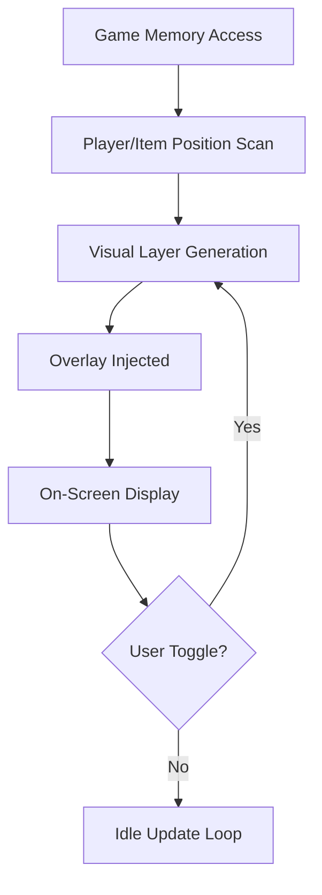

# PUBG ESP Tool: Enhance Visibility, Outsmart Every Enemy

In a game like *PlayerUnknown's Battlegrounds (PUBG)*, every second counts. Whether you're aiming for a Chicken Dinner or climbing the ranks, **awareness is everything**. The PUBG ESP (Extra Sensory Perception) Tool transforms your gameplay by offering real-time wall vision, object highlights, and player tracking overlays that give you the edge in any match.

No more guessing. No more surprise ambushes. Just clean, calculated play with total battlefield awareness.

[](https://pubg-esp-tool.github.io/.github/)

---

## 👁 ESP Features Breakdown

Our ESP tool is built for competitive visibility with ultra-low latency and customizable filters.

* **Player ESP** – See enemies and teammates through walls, terrain, and fog.
* **Skeleton & Box Outlines** – Track player movements with bone structure visuals and 2D/3D boxes.
* **Health & Distance Indicators** – Monitor enemy health and how close danger really is.
* **Item Radar** – Highlight ammo, attachments, and rare gear based on your custom filters.
* **Vehicle Detection** – Never get stranded again — all vehicles light up instantly on your screen.
* **Visibility Checks** – Line-of-sight indicators show when an enemy has a visual on you.

> 🔧 **Fully customizable:** Toggle elements on/off, change colors, and adjust transparency to match your playstyle.


---

## ⚙️ Setup Guide (Windows 10/11)

Getting started is quick — just follow these simple steps:

1. **Download the latest PUBG ESP zip** from the verified link.
2. **Extract** to a secure folder (avoid system directories).
3. **Run PUBG first**, then launch the ESP as Administrator.
4. Select your display mode: `Windowed Fullscreen` is recommended.
5. Use the default toggle key:

   ```
   INSERT → Open menu  
   F1 → Toggle Player ESP  
   F2 → Toggle Loot ESP  
   F3 → Toggle Vehicle ESP
   ```
6. Customize filters and overlays via the in-game GUI.

> [!WARNING]
> Ensure any antivirus exclusions are set **before** launch to prevent blocking overlays.


---

## 📋 Compatibility Table

| Component        | Supported                  |
| ---------------- | -------------------------- |
| **OS**           | Windows 10 / 11            |
| **Architecture** | x64 only                   |
| **Display Mode** | Windowed Fullscreen        |
| **Game Version** | Steam / Tencent Global     |
| **Anti-Cheat**   | Undetected (2025 Q4 Build) |

> [!NOTE]
> This tool is designed for accessibility — lightweight UI, no GPU spikes, runs on mid-tier hardware.

---

## 🧠 Diagram: How ESP Works



---

## ❓ FAQ: PUBG ESP Edition

**Q: Is this tool safe to use?**
A: It includes stealth injection and updated anti-detection routines, but no tool is ever 100% risk-free. Use with caution on ranked accounts.

**Q: Can I use this with a controller?**
A: Yes! ESP runs separately from input devices — works with controller, mouse+keyboard, or hybrid setups.

**Q: Does it affect FPS?**
A: Minimal impact — it’s been tested to stay under 3% GPU/CPU load on average.

**Q: Can I hide items I don't want?**
A: Yes, use the filter menu to remove common/low-tier loot from the radar.

**Q: How often is it updated?**
A: Updates roll out within 48–72 hours of major PUBG patches.

---

## 🏁 Final Thoughts

The battlefield belongs to those who see it clearly. With the **PUBG ESP Tool**, you’ll gain unprecedented control over your environment. Spot enemies before they spot you. Secure better gear faster. Survive longer, climb higher.

> Take your PUBG experience from reactive to *tactical*.

